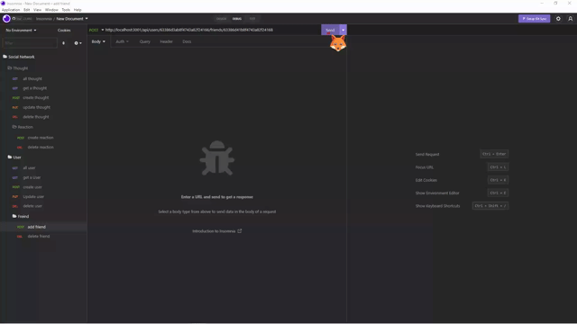
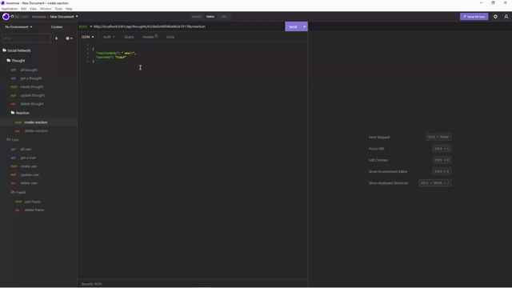

# Social-Network-API📡

## Description

A Network where you can add friends, write your thoughts and react to thoughts.

## Table of Contents

- [User Story](#user-story)

- [Acceptance Criteria](#acceptance-criteria)

- [Images](#images)

- [Questions](#questions)

## User Story

---

AS A social media startup
I WANT an API for my social network that uses a NoSQL database
SO THAT my website can handle large amounts of unstructured data

## Acceptance Criteria

---

GIVEN a social network API

WHEN I enter the command to invoke the application

THEN my server is started and the Mongoose models are synced to the
MongoDB database

WHEN I open API GET routes in Insomnia for users and thoughts

THEN the data for each of these routes is displayed in a formatted JSON

WHEN I test API POST, PUT, and DELETE routes in Insomnia

THEN I am able to successfully create, update, and delete users and thoughts in my database

WHEN I test API POST and DELETE routes in Insomnia

THEN I am able to successfully create and delete reactions to thoughts and add and remove friends to a user’s friend list
Mock-Up

## Images

---

_GET routes to return all users and all thoughts_

_GET routes to return a single user and a single thought_

_POST, PUT, and DELETE routes for users_

_POST, PUT, and DELETE routes for thoughts_

_POST and DELETE routes for a user’s friend_

_POST and DELETE routes for reactions to thoughts_

## Questions

---

[Video](https://drive.google.com/file/d/1xgDzAjOqOY0grxJRlMiNTabFUR9i-2Zu/view?usp=sharing)

[GitHub](https://github.com/)
